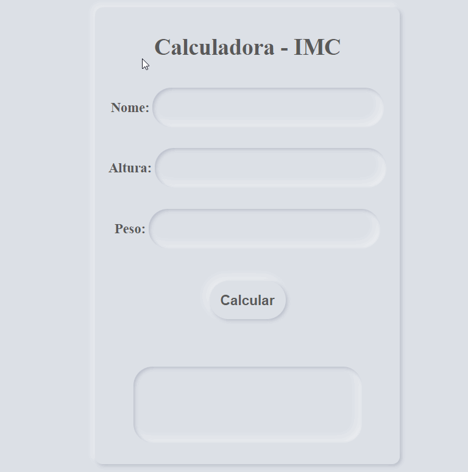

<h1 align="center"> Calculadora de IMC</h1>

</img>

---

#### HTML5, CSS3 & Javascript mini projeto para treino das Tecnologias com efeito neumorphism, preciso melhorar muito mas isso é questão de tempo.

---

<h3>Créditos :</h3>

- Fernando Leonid [GitHub](https://github.com/fernandoleonid).

- YouTube [Canal](https://www.youtube.com/c/FernandoLeonid/about).

---

|        [Erick F.](https://github.com/Nic-Developer)         |
| :---------------------------------------------------------: |
|  |
